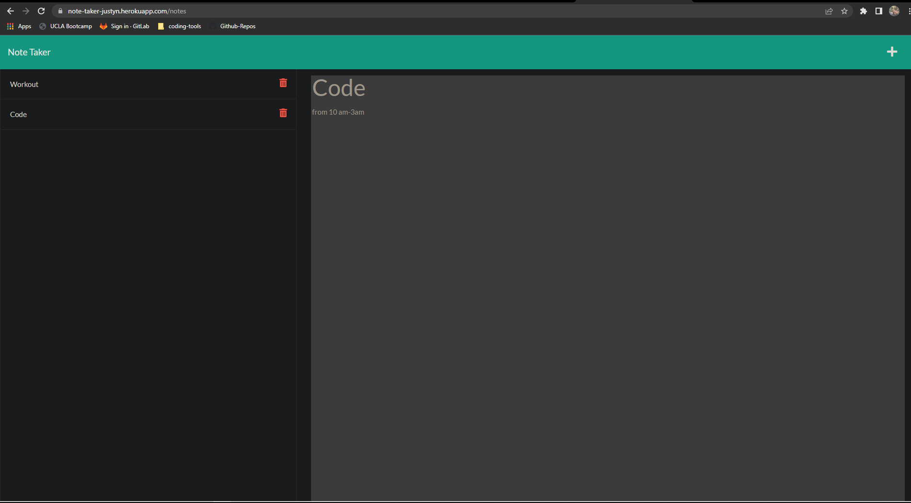

# JS-Note-Taker

# Table of Contents
* [Description](#description)
* [Functionality](#functionality)
* [Image](#image)
* [Deployed Link](#deployed-link)
* [Installation](#installation)
* [Contact](#contact)

# Description 
* An application used to write and save notes
* With the use of express the user is able to retreive or add generated data from a JSON file
* The finished application deployed on Heroku
# Functionality
* Using <code>get</code> to retrieve previously saved notes
* Using <code>post</code> to post new notes
* Using <code>delete</code> to remove saved notes

# Image

# Deployed Link
* <a href="https://note-taker-justyn.herokuapp.com/">JS Note Taker</a>

# Installation
* Download or clone repository
* Use a text editor to view all coding, Visual Studio Coding is recommended.

# Contact
<a href="https://github.com/JustynSubrai">GitHub</a>

[Return to top](#JS-Note-Taker)